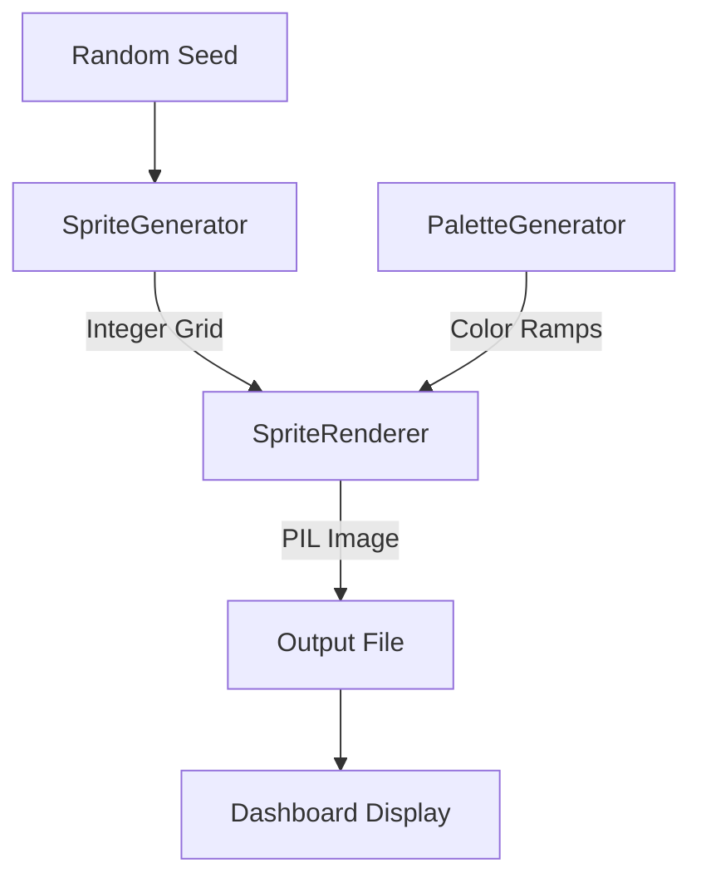
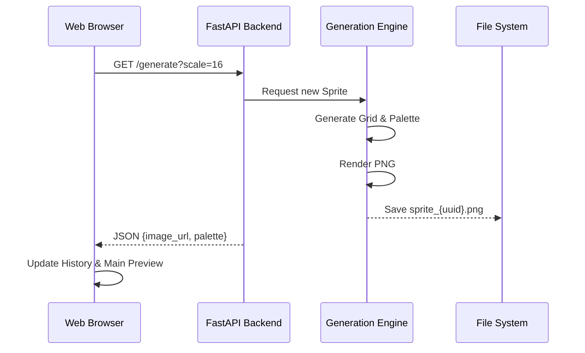

# PixelForge Architectural Model

This document provides a formal representation of the Pixel Art Generator's architecture, data flow, and component relationships.

## Core Architectural Philosophy
The system follows a **Modular Pipeline Architecture**. Each stage of the generation process is decoupled, allowing for future expansion into new art styles.

## 1. Generation Pipeline
The internal logic flows from abstract grid generation to concrete image rendering.

### Component Roles:
- **SpriteGenerator**: Uses probabilistic masks and symmetry rules to create a 2D integer matrix representing the DNA of the sprite.
- **PaletteGenerator**: Applies color theory heuristics (Hue-Shifting) to create harmonious ramps.
- **SpriteRenderer**: The bridge between math and art. It interprets the grid, calculates border lighting, and applies palettes.

## 2. Web Application Flow

## 3. Data Schema
- **The DNA (Grid)**: A np.ndarray of shape (H, W) where values are [0: Empty, 1: Body, 2: Accent, 3: Detail].
- **The Skin (Palette)**: A List[List[RGB]] containing 3 ramps of 4-5 shades each.
- **The Asset**: A pixel-perfect RGBA PNG file with scale applied via Nearest-Neighbor resampling.
